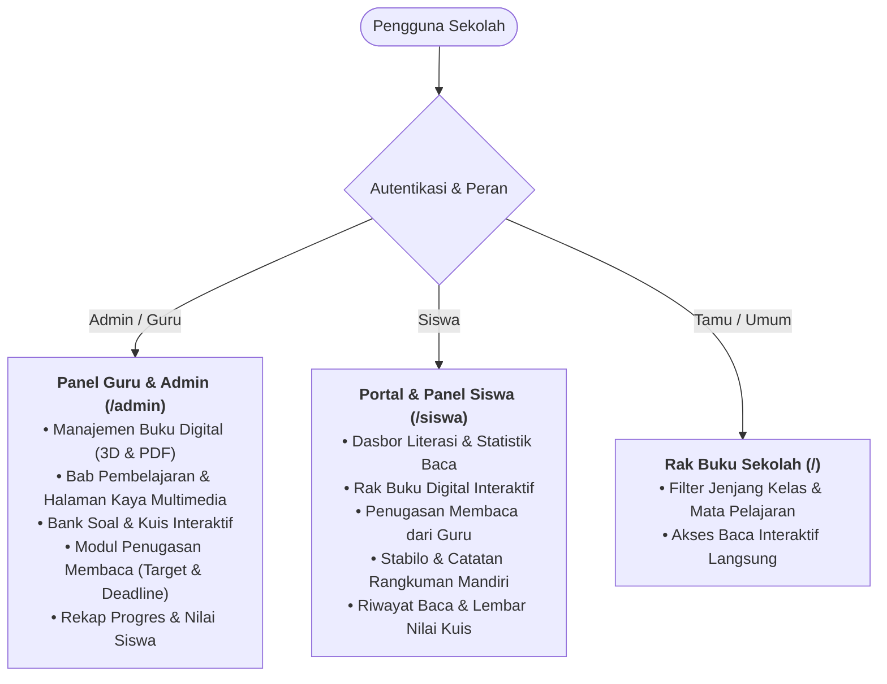

# Pustaka Digital Sekolah

**Pustaka Digital Sekolah** adalah platform sistem informasi perpustakaan dan buku digital interaktif modern yang dirancang untuk mendukung ekosistem literasi sekolah dan Kurikulum Merdeka dari jenjang SD, SMP, hingga SMA/SMK.

Platform ini memadukan sensasi membaca lembaran buku fisik 3D (*realistic flipbook*), modul audio narasi Text-To-Speech (TTS), video pembelajaran multimedia, evaluasi kuis otomatis, modul penugasan membaca berbatas waktu, serta fitur stabilo digital dan catatan rangkuman mandiri yang terhubung langsung ke akun siswa.

---

## 🚀 Fitur Unggulan & Proses Bisnis



### 1. 📖 Pembaca Buku Interaktif 3D & Mode Baca Fokus
- **Mode Buku 3D Realistis (*StPageFlip Engine*)**: Efek membalik lembaran kertas dinamis, bayangan buku, sampul *hardcover*, serta simulasi suara lembaran kertas prosedural (*Web Audio API*).
- **Mode Baca Fokus (*Single Sheet Classic*)**: Tampilan vertikal yang nyaman dan bersih untuk perangkat bergerak atau sesi membaca intensif.
- **Audio Narasi & Text-to-Speech (TTS)**: Mendukung audio narator rekaman guru (MP3) maupun pembacaan otomatis suara Bahasa Indonesia via *Web Speech API*.
- **Penyematan Multimedia**: Integrasi gambar ilustrasi materi dan sematan video pembelajaran interaktif (*YouTube / MP4*).
- **Dock Kontrol Cepat**: Slider penelusuran halaman (*scrubber*), tombol layar penuh (*fullscreen*), toggle suara kertas, dan daftar isi mengambang.

### 2. 🔒 Proteksi Buku Digital & PDF Terenkripsi
- **Distribusi PDF Aman**: File buku PDF dilindungi oleh *Secure PDF Controller* dengan URL bertoken waktu (*expiring token*).
- **Proteksi Hak Cipta**: Penonaktifan toolbar cetak dan unduh default browser untuk mencegah pembajakan buku sekolah tanpa izin.

### 3. 🏆 Evaluasi Pemahaman & Kuis Interaktif Bab
- **Kuis Real-Time Tanpa Reload**: Ditenagai oleh *Livewire v3*, siswa dapat langsung menjawab soal pilihan ganda di akhir bab.
- **Keamanan Kunci Jawaban**: Kunci jawaban diproses 100% di sisi server (*server-side grading*), tidak pernah dibocorkan ke kode sumber JavaScript siswa.
- **Batas Kelulusan (*Passing Score*)**: Menampilkan skor instan, status kelulusan, dan menyimpan riwayat ujian ke buku rapor digital siswa.

### 4. 📌 Modul Penugasan Membaca (Reading Assignments)
- **Penugasan oleh Guru**: Guru dapat menugaskan buku tertentu dengan target bab khusus, batas waktu pengerjaan (*deadline*), dan memilih siswa target.
- **Sinkronisasi Kemajuan Otomatis**: Progres membaca siswa diperbarui secara *real-time* saat mereka membalik lembaran buku.
- **Rekapitulasi Kelas**: Guru dapat melihat tabel ringkasan siapa saja siswa yang sudah selesai membaca, sedang membaca, atau belum membaca.
- **Widget Siswa**: Siswa memiliki menu khusus *"Tugas Membaca"* dan pengingat *deadline* di dasbor belajar mereka.

### 5. 🖍️ Stabilo & Catatan Digital (Highlighter & Sticky Notes)
- **Highlighter Toolbar Teks Cepat**: Siswa cukup menyeleksi kalimat penting di halaman buku untuk menampilkan bilah stabilo dengan 6 pilihan warna:
  - 🟡 Kuning (`#fef08a`)
  - 🟢 Hijau (`#86efac`)
  - 🔵 Biru (`#93c5fd`)
  - 🟠 Oranye (`#fdba74`)
  - 🟣 Ungu (`#d8b4fe`)
  - 🌸 Pink (`#f9a8d4`)
- **Catatan Rangkuman Mandiri**: Siswa dapat menyematkan catatan penjelasan pada kalimat yang distabilo atau membuat catatan mandiri per halaman buku.
- **Slide-over Drawer Catatan**: Laci catatan yang dapat dibuka kapan saja di sisi kanan layar pembaca buku, lengkap dengan fitur:
  - Lompat ke halaman catatan terkait (*One-click jump*)
  - Tombol **📋 Salin Rangkuman** untuk menyalin semua catatan buku ke *clipboard* format Markdown.
- **Manajemen Catatan di Panel Siswa (`/siswa/catatan-stabilo`)**: Halaman khusus untuk melihat seluruh kumpulan stabilo dan catatan rangkuman dari semua buku yang pernah dipelajari.

### 6. 🏅 Lencana Literasi, Reading Streak & Papan Peringkat (Gamifikasi)
- **Reading Streak Harian (🔥)**: Melacak konsistensi membaca harian siswa secara otomatis. Streak bertambah jika siswa membaca buku pada hari berikutnya tanpa jeda, menyimpan rekor terpanjang (*Longest Streak*), dan memberikan bonus Poin Literasi bertingkat.
- **Sistem Lencana Otomatis (🏅)**: Pemberian lencana instan saat siswa memenuhi kriteria pencapaian belajar:
  - 🌱 **Kutu Buku Pemula**: Membuka dan membaca buku digital pertama.
  - 🔬 **Penjelajah Sains**: Menuntaskan seluruh materi buku bertopik IPA / Sains.
  - ⚡ **Semangat 3 Hari**: Konsisten membaca selama 3 hari berturut-turut.
  - 🔥 **Membaca 5 Hari Berturut-turut**: Mencapai streak membaca 5 hari tanpa jeda.
  - 💯 **Juara Kuis 100**: Meraih nilai sempurna 100 pada kuis evaluasi materi.
  - 🎯 **Ahli Evaluasi Tangkas**: Berhasil lulus minimal 3 evaluasi kuis bab.
  - 📝 **Kolektor Catatan Literasi**: Menulis minimal 5 catatan rangkuman dan stabilo.
  - 👑 **Pembaca Tamat**: Menyelesaikan membaca minimal 3 buku hingga 100%.
- **Papan Peringkat Literasi (`/siswa/papan-peringkat`)**:
  - Podium visual Top 3 (🥇 Juara 1 Emas, 🥈 Juara 2 Perak, 🥉 Juara 3 Perunggu).
  - Filter jangkauan ranking: **Semua Siswa Sekolah** atau **Kelas Saya**.
  - Sorotan baris khusus untuk siswa yang sedang login sehingga mereka mudah mengetahui posisinya di sekolah.
- **Etalase Lencana (`/siswa/lencana-literasi`)**:
  - Kartu lencana visual dengan status pita emas (*Telah Diraih*) atau abu-abu (*Terkunci*).
  - Bar progres otomatis yang menunjukkan sejauh mana kriteria lencana telah dicapai siswa.
- **Widget Dasbor Terintegrasi**: Statistik harian *Reading Streak 🔥* dan *Peringkat Literasi ⭐* langsung tampil di dasbor utama panel siswa.

### 7. 🤖 Text-to-Speech (TTS) AI Otomatis & Karaoke Follow-Along
- **Narasi Otomatis Berbahasa Indonesia Alami (`id-ID`)**: Untuk halaman buku yang belum memiliki berkas rekaman narator manual dari guru, sistem secara otomatis mengaktifkan modul pemutar AI TTS alami.
- **Deteksi Karakter Suara Cerdas**: Mendeteksi dan memprioritaskan profil suara Bahasa Indonesia terbaik yang terpasang di browser (*Google Bahasa Indonesia*, *Microsoft Gadis Natural*, *Microsoft Ardi*, dsb.) dengan opsi pemilihan karakter suara.
- **Karaoke Follow-Along (Sorotan Kalimat Berjalan)**: Kalimat materi yang sedang dilafalkan AI otomatis disorot dengan warna emas bercahaya (`.tts-active-sentence`) dan digulirkan secara halus (*smooth auto-scroll*) agar siswa dapat menyimak dan melatih pelafalan kata demi kata.
- **Interaksi Klik Kalimat**: Siswa dapat mengklik sembarang kalimat di lembaran buku untuk langsung mendengarkan pembacaan mulai dari titik kalimat tersebut.
- **Panel Pemutar & Visualizer Gelombang Suara**:
  - Tombol kontrol lengkap: **Putar (Play)**, **Jeda (Pause)**, **Lanjutkan (Resume)**, dan **Berhenti (Stop)**.
  - Pengatur laju kecepatan bicara: `0.8x` (perlahan untuk siswa pemula), `1.0x` (normal), `1.25x`, hingga `1.5x`.
  - Animasi dinamis gelombang audio (*Voice Equalizer Wave*) yang bergerak hidup saat suara AI berbicara.
### 8. 📱 Progressive Web App (PWA) & Mode Offline (IndexedDB)
- **Instalasi Mandiri di Tablet/HP (Tanpa Perlu PlayStore)**:
  - Didukung spesifikasi *Web App Manifest* (`manifest.json`) standar W3C dengan ikon multi-resolusi (72px hingga 512px).
  - Siswa dan guru dapat memasang aplikasi langsung ke layar utama (*Home Screen*) tablet atau smartphone sekolah melalui tombol **"📲 Pasang Aplikasi"** di beranda.
  - Berjalan dalam mode *standalone* tanpa bilah navigasi peramban (*browser chrome*), menghadirkan pengalaman aplikasi native yang imersif dan fokus belajar.
  - *App Shortcuts* bawaan: Akses instan ke Rak Buku Utama, Portal Siswa, dan Papan Peringkat Literasi.
- **Penyimpanan Buku Lokal Berkapasitas Tinggi (*IndexedDB Storage*)**:
  - Tombol **"📥 Simpan Offline"** / **"✅ Tersimpan Offline"** tersemat langsung di bilah atas pembaca buku.
  - Menyimpan seluruh struktur bab, lembaran halaman bacaan, metadata pengarang, serta ilustrasi materi ke dalam database lokal peramban (*`PustakaOfflineDB`*).
  - Memori lokal dapat dikelola dengan mudah oleh siswa; buku yang telah selesai dipelajari dapat dihapus dari perangkat untuk menghemat ruang memori.
- **Service Worker Cerdas & Caching Bertingkat (`sw.js`)**:
  - *Pre-caching Core Shell*: Memuat *library* pembalik buku 3D (*StPageFlip*), PDF viewer, stylesheet, logo sekolah, dan skrip *offline-manager* seketika tanpa jeda tunggu (*instant launch*).
  - *Stale-While-Revalidate*: Menyajikan aset lokal berkecepatan tinggi sambil memperbarui data di latar belakang saat terhubung ke internet.
  - Pengecualian otomatis untuk sinkronisasi dinamis Livewire dan Panel Admin Filament agar data evaluasi tetap valid.
- **Halaman Khusus Mode Offline (`/offline`) & Deteksi Jaringan Real-Time**:
  - Banner peringatan dinamis (*Offline Network Banner*) otomatis muncul saat sinyal Wi-Fi/kuota internet terputus.
  - Halaman khusus `/offline` menyajikan etalase semua buku yang telah diunduh ke memori lokal tablet, memungkinkan siswa melanjutkan kegiatan membaca di ruang kelas tanpa sinyal internet.
### 9. 🔍 Pencarian Kata di Dalam Buku (*In-Book Search*) & Penandaan Otomatis
- **Pencarian Instan Seluruh Halaman (*Zero-Latency Search Engine*)**:
  - Siswa dapat mencari kata kunci, topik, atau istilah spesifik (misal: *"gravitasi"*, *"fotosintesis"*, *"tata surya"*) di seluruh lembaran buku secara *real-time*.
  - Dukungan pintasan papan ketik cepat: Tekan `Ctrl+F` atau `Cmd+F` di halaman pembaca buku untuk membuka panel pencarian instan.
- **Cuplikan Kontekstual (*Rich Excerpt Snippets*)**:
  - Menampilkan ringkasan hasil pencarian per bab dan halaman (misal: *Bab 1 • Hal 2 (3x muncul)*).
  - Kutipan kalimat konteks (*snippet*) menampilkan kata kunci yang dicari dengan penanda visual warna emas (`<mark class="snippet-highlight">`).
- **Navigasi Otomatis & Pembalik Lembaran (*Smart Auto-Jump*)**:
  - Mengklik kartu hasil pencarian akan langsung membalik lembaran buku ke bab & halaman terkait, baik pada mode **Buku 3D** (*StPageFlip*) maupun **Baca Fokus**.
- **Penandaan Kata Otomatis di Halaman (*In-Page Live Highlighting*)**:
  - Setiap kemunculan kata pada halaman yang sedang dibuka otomatis disorot dengan penanda `<mark class="in-book-search-match">`.
  - Sorotan kata aktif (*active match*) ditandai dengan animasi denyut bercahaya (*pulsing glow effect*) dan otomatis digulirkan ke tengah pandangan (*scroll into view*).
  - Kontrol navigasi **▲ Prev** dan **▼ Next** memudahkan siswa melompat dari satu kemunculan kata ke kemunculan berikutnya secara berurutan.

### 10. 🎓 Struktur Jenjang, Kelas & Program Sekolah (Bilingual, Tahfizh, Reguler, STEM)
- **Arsitektur Akademik Berbasis Peminatan/Jalur Belajar**:
  - Sekolah tidak hanya dibagi berdasarkan jenjang (SD, SMP, SMA/SMK) dan tingkat kelas (Kelas 1–12), melainkan juga memiliki **Program Khusus** yang masing-masing memiliki fokus kurikulum, murid, dan mata pelajaran tersendiri:
    - 🌍 **Program Bilingual (Cambridge)**: Pengantar dwibahasa (Inggris & Indonesia), materi *Cambridge Primary Science*, *English Language Arts*, dll.
    - 🕌 **Program Tahfizh Al-Qur'an**: Program hafalan & tahsin Juz 30, Bahasa Arab dasar, serta materi adab islami terstruktur.
    - 🏫 **Program Reguler**: Kurikulum standar nasional terpadu.
    - 🔬 **Program Sains & Riset (STEM)**: Eksperimen terapan, robotika & koding junior, dan matematika lanjut.
- **Dukungan Mata Pelajaran Umum vs Spesifik Program**:
  - Mata pelajaran umum (misal: Matematika, Bahasa Indonesia, Pendidikan Pancasila) dapat diakses oleh semua program (`program_id = null`).
  - Mata pelajaran khusus terhubung langsung ke program terkait sehingga kurikulum belajar siswa lebih terarah dan relevan.
- **Relasi Murid & Lencana Akademik**:
  - Profil siswa terikat pada Kelas (1–12) dan Program Sekolah.
  - Dasbor dan kartu profil siswa menampilkan lencana akademik otomatis (contoh: `Kelas 4 SD • 🌍 Bilingual`).
- **Penyaringan Katalog Publik & Filter Program**:
  - Pengunjung dan siswa dapat menyaring katalog buku berdasarkan **Jenjang Kelas**, **Format Buku (3D / PDF)**, dan **Program Sekolah (Semua / Bilingual / Tahfizh / Reguler)** secara simultan dengan URL query yang persisten.
- **Penugasan Membaca Bertarget Program**:
  - Guru dapat memberikan tugas membaca yang menargetkan siswa pada program sekolah tertentu (misal: tugas bacaan bahasa Inggris hanya untuk murid program Bilingual).

---

## 🏗️ Tumpukan Teknologi (*Tech Stack*)

- **Backend Framework**: [Laravel 11](https://laravel.com/) (PHP 8.2+)
- **Admin & Student Panel**: [Filament v3](https://filamentphp.com/)
- **Komponen Reaktif**: [Livewire v3](https://livewire.laravel.com/)
- **Frontend & Styling**: Tailwind CSS, Vanilla CSS Design System, Lora & Cinzel Typography
- **3D Flipbook Viewer**: StPageFlip Canvas Engine
- **PDF Rendering**: Mozilla PDF.js
- **Database**: SQLite (Default) / MySQL / PostgreSQL

---

## 🗄️ Skema Database Utama

| Tabel | Deskripsi |
|---|---|
| `school_programs` | Master program sekolah/jalur peminatan (Reguler, Bilingual, Tahfizh, STEM) lengkap dengan kode, ikon, dan warna tema. |
| `grades` | Jenjang tingkatan kelas (e.g. Kelas 1 SD s.d. Kelas 12 SMA). |
| `subjects` | Mata pelajaran sekolah (umum atau terikat pada `program_id` dan `level`). |
| `categories` | Kategori bahan pustaka (e.g. Buku Teks Utama, Pengayaan, Ensiklopedia). |
| `books` | Data pokok buku digital (judul, ISBN, penulis, tipe 3D/PDF, sampul, `grade_id`, `program_id`). |
| `chapters` | Bab dan urutan materi pembelajaran dalam buku. |
| `pages` | Halaman interaktif (isi materi, audio MP3, video, gambar). |
| `quizzes` | Evaluasi bab dengan konfigurasi passing score dan durasi. |
| `quiz_questions` & `quiz_options` | Bank butir soal dan opsi pilihan jawaban kuis. |
| `reading_assignments` | Penugasan membaca oleh guru dengan filter kelas dan program sekolah. |
| `reading_assignment_students` | Relasi penugasan ke siswa dengan progres persentase baca. |
| `student_book_annotations` | Stabilo teks terpilih, catatan rangkuman, dan warna penanda. |
| `student_reading_logs` | Catatan halaman terakhir dan persentase keterbacaan siswa. |
| `student_quiz_attempts` | Lembar rekap hasil dan skor evaluasi kuis siswa. |
| `badges` | Master data lencana pencapaian, kategori, kriteria, dan bonus poin. |
| `user_badges` | Relasi perolehan lencana otomatis ke siswa beserta tanggal diraih. |

---

## ⚙️ Panduan Instalasi & Menjalankan Proyek

### 1. Prasyarat Sistem
- PHP >= 8.2 (dengan ekstensi `pdo_sqlite` / `pdo_mysql`, `mbstring`, `openssl`, `curl`)
- Composer >= 2.x
- Node.js >= 18.x & NPM

### 2. Kloning Repositori
```bash
git clone https://github.com/donarazhar/pustakadigital.git
cd pustakadigital
```

### 3. Instalasi Dependensi
```bash
composer install
npm install
```

### 4. Konfigurasi Lingkungan (.env)
```bash
# Salin file konfigurasi lingkungan
cp .env.example .env

# Buat kunci enkripsi aplikasi
php artisan key:generate
```

### 5. Migrasi Database & Seeder
```bash
# Jalankan migrasi dan isi data awal buku demo
php artisan migrate --seed

# Buat symbolic link ke media penyimpanan
php artisan storage:link
```

### 6. Menjalankan Server Lokal
Jalankan kompilasi aset frontend dan web server:
```bash
# Terminal 1: Dev Server PHP
php artisan serve

# Terminal 2: Vite Assets Bundler (opsional untuk pengembangan UI)
npm run dev
```

Aplikasi siap diakses melalui peramban web pada alamat:  
👉 **`http://127.0.0.1:8000`**

---

## 🔑 Akun Uji Coba Default

Setelah menjalankan seeder (`php artisan db:seed`), akun demo berikut siap digunakan:

| Peran (Role) | Email | Kata Sandi | Deskripsi Program & Akses |
|---|---|---|---|
| **Administrator** | `admin@sekolah.id` | `password` | Pengelola sistem & kurikulum (`/admin`) |
| **Guru / Pendidik** | `guru@sekolah.id` | `password` | Penugasan & rekapitulasi nilai (`/admin`) |
| **Siswa Bilingual** | `siswa@sekolah.id` | `password` | Ananda Putri (Kelas 4 SD • Bilingual) (`/siswa`) |
| **Siswa Tahfizh** | `siswa.tahfizh@sekolah.id` | `password` | Ahmad Fauzan (Kelas 4 SD • Tahfizh) (`/siswa`) |
| **Siswa Reguler** | `siswa.reguler@sekolah.id` | `password` | Siti Sarah (Kelas 4 SD • Reguler) (`/siswa`) |

---

## 🧪 Pengujian Otomatis (*Automated Tests*)

Aplikasi dilengkapi dengan suite pengujian otomatis fitur berbasis PHPUnit / Pest:
```bash
php artisan test
```
*Status Uji: **45 passed (181 assertions, 100% green)*** mencakup pengujian pembaca buku 3D & PDF, proteksi kuis, alur tugas membaca, stabilo & catatan mandiri, gamifikasi & lencana literasi, TTS AI, PWA & mode offline, in-book search, serta struktur jenjang, kelas, dan program sekolah.

---

## 📄 Lisensi

Platform ini dikembangkan di bawah lisensi terbuka [MIT License](LICENSE).
