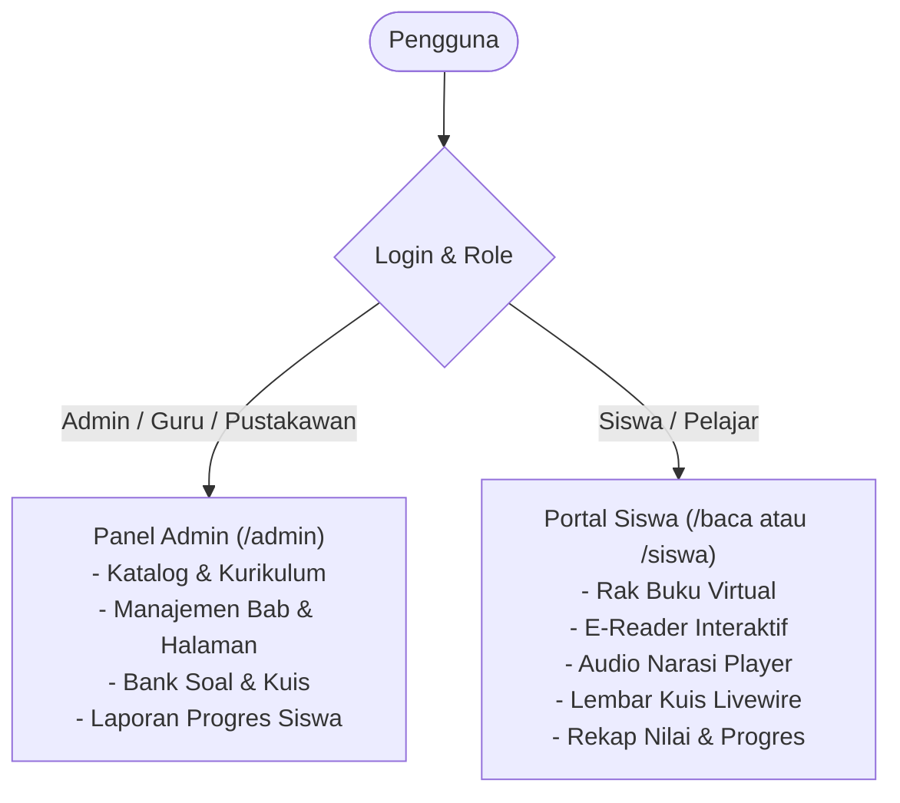

# Cetak Biru Sistem Informasi Buku Digital Interaktif Sekolah

Sistem informasi buku digital interaktif berbasis **Laravel** dan **Filament v5 (Livewire v4)** dirancang untuk menyajikan buku pembelajaran kaya multimedia (teks, audio narasi, gambar, video) serta evaluasi interaktif (kuis/latihan soal) untuk berbagai jenjang sekolah (SD, SMP, SMA/SMK).

---

## 1. Arsitektur Multi-Panel

---

## 2. Struktur Skema Database (Inti)

### A. Kurikulum & Taksonomi
1. **`grades` (Jenjang / Tingkat Kelas)**:
   - `id`, `name` (e.g., "Kelas 1 SD", "Kelas 7 SMP", "Kelas 10 SMA"), `level` (SD, SMP, SMA, SMK), `order`.
2. **`subjects` (Mata Pelajaran)**:
   - `id`, `name` (e.g., "Bahasa Indonesia", "Matematika", "IPA", "Sejarah"), `code`, `icon`, `color`.
3. **`categories` (Kategori Buku)**:
   - `id`, `name` (e.g., "Buku Tematik", "Buku Teks Utama", "Buku Pengayaan", "Komik Edukasi"), `slug`.

### B. Konten Buku & Bab
4. **`books` (Data Buku)**:
   - `id`, `title`, `slug`, `author`, `publisher`, `publication_year`, `isbn`, `cover_image`, `description`, `grade_id`, `subject_id`, `category_id`, `is_published`, `estimated_read_time`.
5. **`chapters` (Bab / Bagian Buku)**:
   - `id`, `book_id`, `title`, `chapter_number`, `order`, `summary`.
6. **`pages` (Halaman / Lembaran Interaktif)**:
   - `id`, `chapter_id`, `page_number`, `title`, `content` (Rich Text / HTML), `audio_narration_url` (MP3 narasi pembacaan), `featured_image`, `video_embed_url`.

### C. Evaluasi & Kuis Interaktif
7. **`quizzes` (Kuis per Bab)**:
   - `id`, `chapter_id`, `title`, `description`, `passing_score`, `time_limit_minutes`.
8. **`quiz_questions` (Pertanyaan Kuis)**:
   - `id`, `quiz_id`, `question_text`, `question_image`, `question_type` (multiple_choice, true_false), `order`, `explanation`.
9. **`quiz_options` (Pilihan Jawaban)**:
   - `id`, `question_id`, `option_text`, `is_correct`.

### D. Siswa, Progres & Riwayat
10. **`users` (Akun Pengguna)**:
    - `id`, `name`, `email`, `role` (admin, teacher, student), `grade_id` (untuk siswa).
11. **`student_reading_logs` (Progres Baca Siswa)**:
    - `id`, `user_id`, `book_id`, `last_chapter_id`, `last_page_id`, `progress_percent`, `is_completed`, `last_read_at`.
12. **`student_quiz_attempts` (Hasil Kuis Siswa)**:
    - `id`, `user_id`, `quiz_id`, `score`, `total_questions`, `correct_answers`, `is_passed`, `submitted_at`.

---

## 3. Komponen Antarmuka Pembaca (Interactive E-Reader)
- **Tampilan Bersih & Fokus**: Mode bebas distraksi (*reader mode*) yang nyaman di desktop, tablet, maupun ponsel.
- **Audio Bar Sinkron**: Kontrol pemutar suara narasi (*play/pause/speed control*) di bagian bawah halaman.
- **Kuis Real-Time (Livewire v4)**: Di akhir bab, kuis langsung aktif dengan skor instan tanpa reload browser.
- **Navigasi Bab Cepat**: Drawer daftar isi untuk melompat antar bab dan melihat indikator centang bab yang sudah dibaca.

---

## 4. Rencana Tahapan Eksekusi
1. **Langkah 1**: Inisialisasi proyek Laravel di direktori kerja.
2. **Langkah 2**: Instalasi dan konfigurasi Filament v5.
3. **Langkah 3**: Konfigurasi database MySQL (`buku_digital_db`) dan pembuatan migration skema inti.
4. **Langkah 4**: Pembuatan Filament Resources di Panel Admin (Kategori, Jenjang, Mata Pelajaran, Buku, Bab, Halaman, dan Kuis).
5. **Langkah 5**: Pembangunan portal baca interaktif untuk siswa (Livewire + Blade).
